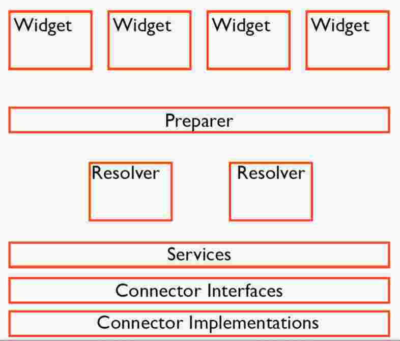

#Vertical Reusablility Through Components

### Volker Dusch
S
- [@__edorian](https://twitter.com/__edorian) 
- [Travail chez ResearchGate](http://www.researchgate.net/)
- http://confoo.ca/fr/2015/session/vertical-reuseablility-through-components
- [slides](https://dl.dropboxusercontent.com/u/3615626/slides/Vertical-reusability-through-components-PHPNW13-Manchester.pdf)
- Son talk sur [Youtube](https://www.youtube.com/watch?v=l-ZckcPVnN8)


## Problems
- Routing complexes
- Beaucoup de complexités
- Lot of legacy code, conceptes
- Facile à briser juste en changeant quelques

## Objectifs
- réutilisation des composantes (modules)
- comment mieux structurer notre code
- permettre la réutilisation
- améliorer les performances
- minimiser les temps de chargement
- chaque élément de la page peut vivre indépendemment du son contexte. Peux donc être réutilisé dans n'importe quelle page du site. 
- chaque composante ou widget, peut être activé et rendu séparément

## Concepts
- Chaque petite partie de la page est un widget et est relié a une classe PHP
- séparer sa page en components

## JS
- Le Javascript est inclus dans le widget
- Le JS permettant de binder les événements du dom et de contrôler le widget est inclus dans le component

## templates
- Ils utilise mustace comme templating et est rendered autant du côté client que tu côté serveur
- Les templates sont situé sur un CDN et caché par le client
- Seulement les données en JSON sont envoyé au client et rendered du côté client
- V8js
- Laisser peut te rôle au template, juste quelques if ou loop
- Aucune logique dans le template, seulement la manière de présenté les données

## Mustace
```html
<div id="{{widgetId}}" class="question">
    <h2>{{#title}}</h2>
    <p>{{#content}}</p>
    {{#showComments}}
        Comments:
        {{#comments}}
            <hr>
            {{{.}}}
        {{/comments}}
    {{/showComments}}
</div>
```

### Roles dans le  Widget
- *PHP Controller* - Fournir le data
- *Mustache* - Afficher le data
- *Javascript* view classes - Gestion des événements du nagigateur

## Quelques propriétés d'une widget
- un widget peux contenir d'autres widget
    - la page est elle même un component
- Le widget n'appel pas de service directement, il ne fait que demander ce qu'il a besoin
 

--- 
## Example avec une page de profile d'un utilisateur
- Put "profile header for $userId" on top
- Put "main profile content for $userId" to the left
- Put "secondary profile content for $userId" to the right

### Contenues secondaire du profile
- Render a list of:
    - Affiliation for $userId
    - Skill teaser of $userId
    - Top co authors of $userId
    - People following $userId
---

## Performance - Ask.. don't fetch
- Seulement déclarer ce que le widget a besoin
    - example ne pas afficher le widget si un usager a moins que 3 skills
- Ne pas demander de data qu'il n'a pas besoin
- Tout ca se fait par des déclarations dans les balises HTML
    
- les components ne parlent pas ensemble sauf s'il est inclus a l'intérieur d'autre component

## Requirements types
- RequestDataRequirement: Enforce input from request or
context
- EntityRequirement: Get Doctrine2 entities
- ServiceRequirement: Talk to a service
- WidgetRequirement: Include another component

---

- Class Preparer ... what do you need
- Class Resolver ... Knowing quel services nous devons appeler



---

```php
public $account;
public $skillMapping;

public function collect() {
    yield [
        new RequestDataRequirement('accountKey', 'accountKey')
    ];
    yield [
        new EntityRequirement(
            'account',
            Account::class,
            array('key' => $that->accountKey)
        )
    ]

    yield [
        new ServiceRequirement(
            'skills',
            SkillService::class,
            'getSkillByAccountId',
            array('accountId' => $that->account->getId())
        )
    ];
    
    $requirements = array();
    foreach ($that->skills as $skill) {
        $requirements[] = new WidgetRequirement(
            'skillWidgets',
            Skill::class,
            array('skillId' => $skill->getId())
        );
    }
    yield $requirements;
}

```

---


## notes
- c'est un peux comme nos box


## see
- php yield
- react.js

